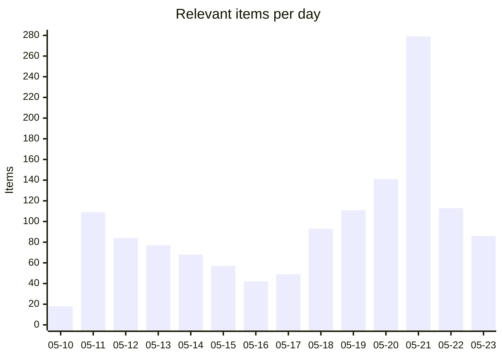
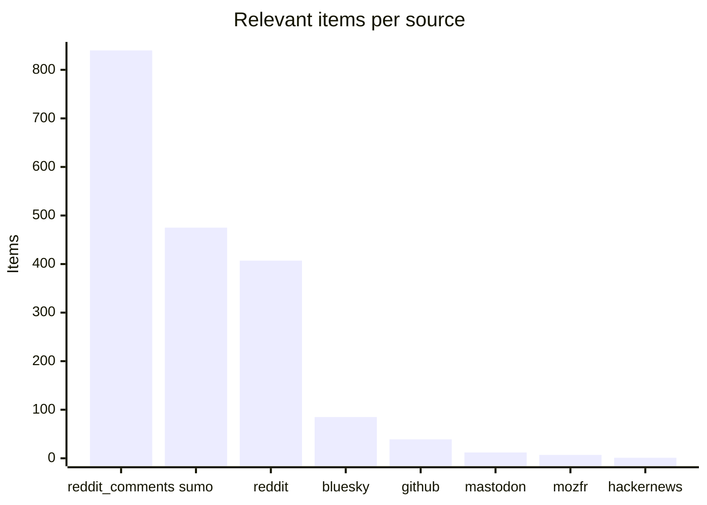
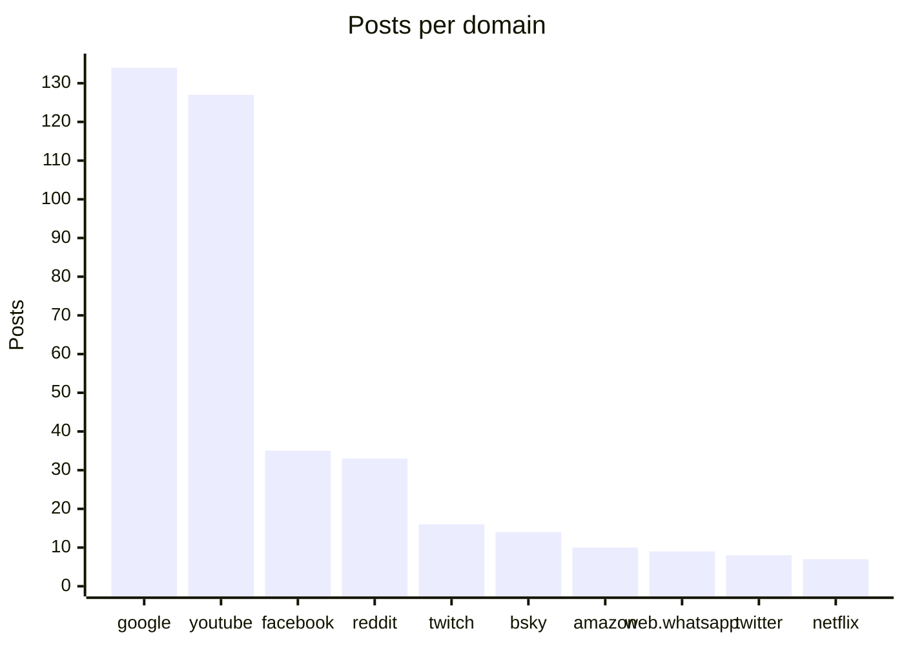

# Social Scanner — WebCompat dashboard

Auto-generated WebCompat signal from Reddit (submissions + r/firefox comments), Hacker News, Bluesky, Mastodon, and support.mozilla.org. Posts are classified via Claude Haiku into site-specific webcompat issues and Firefox-platform issues, cross-referenced against Bugzilla and webcompat/web-bugs to surface what's already on file.

_Generated: 2026-05-23T19:07:06.955064+00:00 · Last scan: 2026-05-23T19:05:03.307067+00:00_

## Headlines

| | Count |
|---|---:|
| Posts pulled across all sources | 13,784 |
| Posts classified relevant | **1866** |
| ↳ Webcompat with a domain | 642 |
| ↳ Webcompat without a clear domain | 34 |
| ↳ Firefox platform issues | 1190 |

### Bugs on file vs potentially new

| Bucket | Items | With likely match | Potentially new |
|---|---:|---:|---:|
| Webcompat (with domain) | 642 | 101 | **541** |
| Firefox platform | 1190 | 72 | **1118** |

**1693 actionable items** (no clear matching bug filed): 541 webcompat-with-domain, 34 webcompat-no-domain, 1118 platform.

## Charts

### Daily relevant items (last 14 days)

### Bugs on file vs potentially new

### Relevant items by source

### Top domains by report volume

## Trends (week over week)

**914** relevant items this week vs **420** last week (+494, up).

**Escalating domains** (≥2 more reports this week):
- `google.com`: 11 → 108 (+97)
- `youtube.com`: 34 → 51 (+17)
- `twitch.tv`: 2 → 9 (+7)
- `amazon.com`: 2 → 7 (+5)
- `id.me`: 1 → 6 (+5)
- `web.whatsapp.com`: 2 → 5 (+3)
- `docs.google.com`: 1 → 3 (+2)
- `facebook.com`: 5 → 7 (+2)

**New domains** (no reports last week, ≥2 this week):
- `twitter.com`: 7 reports
- `maps.google.com`: 3 reports
- `protonmail.com`: 3 reports
- `chatgpt.com`: 2 reports
- `discord.com`: 2 reports
- `homedepot.com`: 2 reports
- `meet.google.com`: 2 reports
- `qwant.com`: 2 reports

## Top clusters

Domains by report volume across the entire dataset:

| Domain | Posts | Likely match on file | Potentially new |
|---|---:|---:|---:|
| `google.com` | 134 | 26 | **108** |
| `youtube.com` | 127 | 21 | **106** |
| `facebook.com` | 35 | 0 | **35** |
| `reddit.com` | 33 | 3 | **30** |
| `twitch.tv` | 16 | 7 | **9** |
| `bsky.app` | 14 | 6 | **8** |
| `amazon.com` | 10 | 4 | **6** |
| `web.whatsapp.com` | 9 | 2 | **7** |
| `twitter.com` | 8 | 0 | **8** |
| `netflix.com` | 7 | 4 | **3** |

## High-urgency items with no matching bug

Top webcompat reports by urgency where the matcher found no likely match in Bugzilla or webcompat/web-bugs. These are the candidates for a new filing:

- **`youtube.com`** · urgency 95 · reddit_comments
  YouTube breaks after Firefox reboot until user profile is replaced; issue started with latest FF update, doesn't occur i
  · [post](https://reddit.com/r/firefox/comments/1th369d/youtube_again/omtxxhk/)
- **`google.com`** · urgency 85 · reddit_comments
  Google Search shows CAPTCHA in Firefox but not in Chrome, blocking search access.
  · [post](https://reddit.com/r/firefox/comments/1tjgmli/google_search_tries_to_force_google_chrome_on_you/on2b8lb/)
- **`facebook.com`** · urgency 85 · sumo
  Facebook reCAPTCHA login broken in Firefox 151.0, works in 150.0.3
  · [post](https://support.mozilla.org/en-US/questions/1582718)
- **`jquery.com`** · urgency 85 · github
  jQuery animation promise gets stuck in infinite loop when `.then()` handler added in start callback, freezing browser
  · [post](https://github.com/jquery/jquery/issues/5534)
- **`amazon.com`** · urgency 85 · sumo
  Firefox freezes during Amazon login and security authentication, causing payment failures; works in Safari.
  · [post](https://support.mozilla.org/en-US/questions/1580185)

## High-urgency Firefox platform issues

Top platform-level reports by urgency. These don't tie to a single domain:

- urgency 95 · User lost their entire Firefox profile and years of bookmarks after a recent update.
  · [post](https://reddit.com/r/firefox/comments/1thtq98/just_lost_my_whole_profile_and_years_of_bookmark/ompi7kc/)
- urgency 95 · Firefox profile and years of bookmarks lost after an update
  · [post](https://reddit.com/r/firefox/comments/1thtq98/just_lost_my_whole_profile_and_years_of_bookmark/omqbi07/)
- urgency 95 · Firefox update caused loss of entire profile and bookmarks.
  · [post](https://reddit.com/r/firefox/comments/1thtq98/just_lost_my_whole_profile_and_years_of_bookmark/omq5me5/)
- urgency 95 · User lost entire profile and years of bookmarks after Firefox update
  · [post](https://reddit.com/r/firefox/comments/1thtq98/just_lost_my_whole_profile_and_years_of_bookmark/omxynl2/)
- urgency 95 · Firefox Mobile deleting downloaded files without user knowledge after update
  · [post](https://reddit.com/r/firefox/comments/1tj7qnk/warning_firefox_mobile_is_deleting_downloaded/omzuu8j/)

## Platform issues already on file

Platform reports the matcher confirmed against existing bugs:

- **Firefox 140.9.1esr and later show some PDFs as blank white pages while other browsers and ** → [BMO#1671854](https://bugzilla.mozilla.org/show_bug.cgi?id=1671854)  _pdf-viewer renders certain files incorrectly_
- **Bookmarks imported from Chrome are not visible in Firefox 150.0.1 after import.** → [BMO#2037345](https://bugzilla.mozilla.org/show_bug.cgi?id=2037345)  _Imported Bookmarks from Chrome, but nowhere it is visible in Firefox Browser_
- **All bookmarks disappeared after Firefox update.** → [BMO#2017721](https://bugzilla.mozilla.org/show_bug.cgi?id=2017721)  _all my bookmarks thumbnails disappeared (BIG POOF!)_
- **Firefox Mobile automatically deleted downloaded files after update due to auto-enabled set** → [BMO#1832721](https://bugzilla.mozilla.org/show_bug.cgi?id=1832721)  _Downloaded file automatically deleted when i unstall Firefox_
- **Firefox Mobile deletes downloaded files without user consent after update.** → [BMO#947536](https://bugzilla.mozilla.org/show_bug.cgi?id=947536)  _When Firefox restarts after crash, it deletes active downloaded files, and start_

## Latest reports

- [2026-05-23](2026/2026-05/2026-05-23.md) — 86 items
- [2026-05-22](2026/2026-05/2026-05-22.md) — 113 items
- [2026-05-21](2026/2026-05/2026-05-21.md) — 279 items
- [2026-05-20](2026/2026-05/2026-05-20.md) — 141 items
- [2026-05-19](2026/2026-05/2026-05-19.md) — 111 items
- [2026-05-18](2026/2026-05/2026-05-18.md) — 93 items
- [2026-05-17](2026/2026-05/2026-05-17.md) — 49 items
- [2026-05-16](2026/2026-05/2026-05-16.md) — 42 items
- [2026-05-15](2026/2026-05/2026-05-15.md) — 57 items
- [2026-05-14](2026/2026-05/2026-05-14.md) — 68 items

## Browse

- [Full reports index](index.md) — every dated report, by month

## How to read each report

Every relevant item carries:

- Source link (Reddit / HN / Bluesky / Mastodon / SUMO)
- Posted timestamp, score, comment count
- Sentiment, severity, urgency score (0-100)
- Gist (one-line summary)
- Reproduction steps when present
- Bug cross-references grouped by match verdict: **Likely match**, **Maybe related**, **Same domain different issue**

The triage round-trip lets you mark items `[x]` triaged or `` `[filed:: BMO#1234567]` `` directly in any report's markdown — the next sync picks up your edits and persists them.

---

_This README is regenerated on every sync from `social-scanner share`. To refresh manually: `uv run social-scanner share`._
