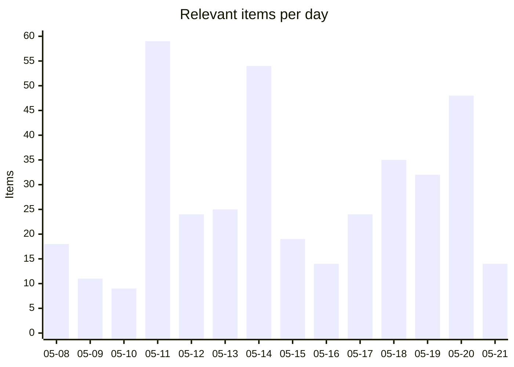
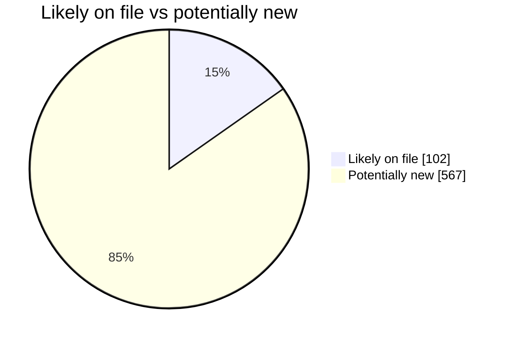
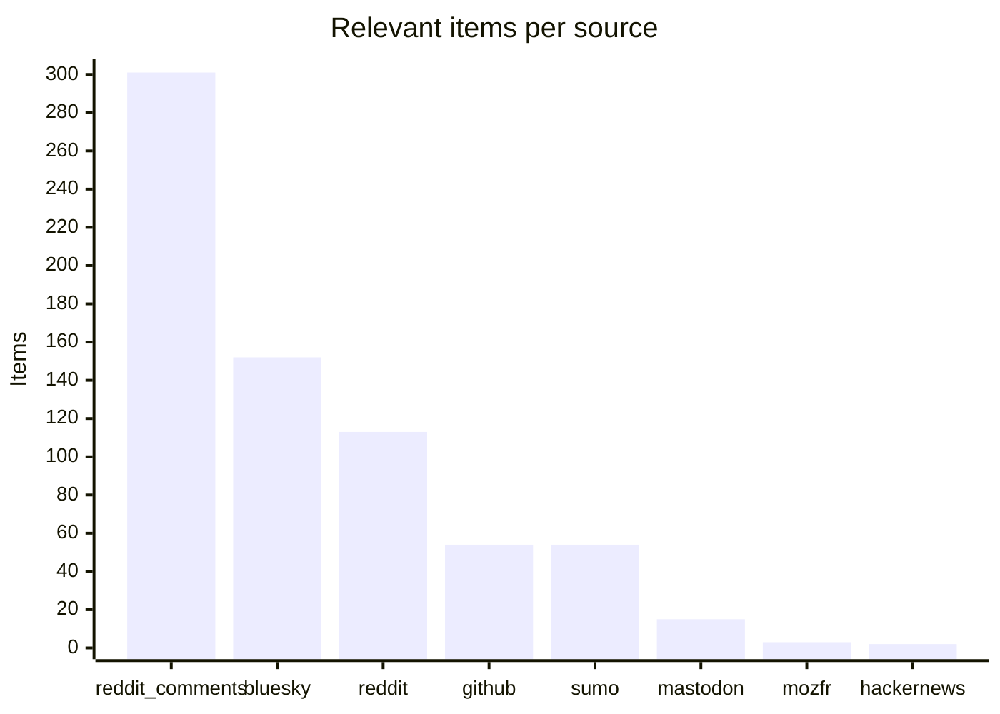
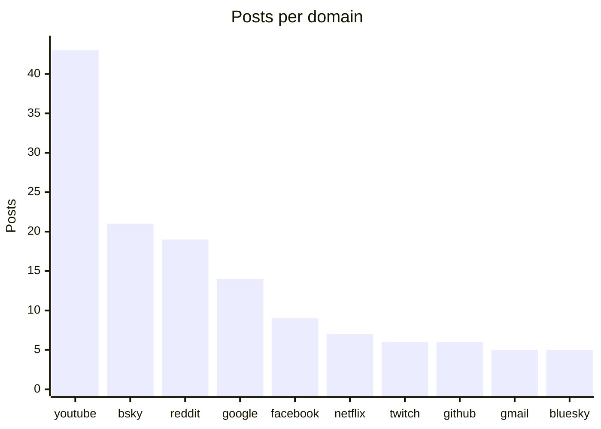

# Social Scanner — WebCompat dashboard

Auto-generated WebCompat signal from Reddit (submissions + r/firefox comments), Hacker News, Bluesky, Mastodon, and support.mozilla.org. Posts are classified via Claude Haiku into site-specific webcompat issues and Firefox-platform issues, cross-referenced against Bugzilla and webcompat/web-bugs to surface what's already on file.

_Generated: 2026-05-21T11:08:44.779036+00:00 · Last scan: 2026-05-21T11:07:47.201574+00:00_

## Headlines

| | Count |
|---|---:|
| Posts pulled across all sources | 11,351 |
| Posts classified relevant | **694** |
| ↳ Webcompat with a domain | 214 |
| ↳ Webcompat without a clear domain | 25 |
| ↳ Firefox platform issues | 455 |

### Bugs on file vs potentially new

| Bucket | Items | With likely match | Potentially new |
|---|---:|---:|---:|
| Webcompat (with domain) | 214 | 69 | **145** |
| Firefox platform | 455 | 33 | **422** |

**592 actionable items** (no clear matching bug filed): 145 webcompat-with-domain, 25 webcompat-no-domain, 422 platform.

## Charts

### Daily relevant items (last 14 days)

### Bugs on file vs potentially new

### Relevant items by source

### Top domains by report volume

## Trends (week over week)

**240** relevant items this week vs **169** last week (+71, up).

**Escalating domains** (≥2 more reports this week):
- `youtube.com`: 3 → 24 (+21)
- `google.com`: 3 → 7 (+4)

**New domains** (no reports last week, ≥2 this week):
- `netflix.com`: 6 reports
- `id.me`: 3 reports
- `facebook.com`: 2 reports
- `twitter.com`: 2 reports

## Top clusters

Domains by report volume across the entire dataset:

| Domain | Posts | Likely match on file | Potentially new |
|---|---:|---:|---:|
| `youtube.com` | 43 | 27 | **16** |
| `bsky.app` | 21 | 11 | **10** |
| `reddit.com` | 19 | 4 | **15** |
| `google.com` | 14 | 8 | **6** |
| `facebook.com` | 9 | 0 | **9** |
| `netflix.com` | 7 | 6 | **1** |
| `twitch.tv` | 6 | 5 | **1** |
| `github.com` | 6 | 0 | **6** |
| `gmail.com` | 5 | 0 | **5** |
| `bluesky.app` | 5 | 1 | **4** |

## High-urgency items with no matching bug

Top webcompat reports by urgency where the matcher found no likely match in Bugzilla or webcompat/web-bugs. These are the candidates for a new filing:

- **`facebook.com`** · urgency 85 · bluesky
  Cannot log in to Facebook in Firefox 150, but login works in Edge.
  · [post](https://bsky.app/profile/mozilla.activitypub.awakari.com.ap.brid.gy/post/3mk52zlum25o2)
- **`reddit.com`** · urgency 85 · reddit_comments
  Reddit doesn't work at all in Firefox
  · [post](https://reddit.com/r/firefox/comments/1te90if/reddit_doesnt_work_at_all/omhsqje/)
- **`facebook.com`** · urgency 85 · sumo
  reCAPTCHA login broken on Facebook after Firefox 151.0 update
  · [post](https://support.mozilla.org/en-US/questions/1582718)
- **`supabase.com`** · urgency 85 · github
  Supabase Control Panel throws DOM error 'insertBefore' on Node preventing any work in product; happens across Firefox, C
  · [post](https://github.com/facebook/react/issues/35698)
- **`youtube.com`** · urgency 80 · reddit_comments
  YouTube interface bug causes excessive RAM usage (7GB+) and browser lag/freezing in Firefox.
  · [post](https://reddit.com/r/firefox/comments/1t3p7uy/seeing_higher_ram_usage_in_firefox_lately_this/olot1qw/)

## High-urgency Firefox platform issues

Top platform-level reports by urgency. These don't tie to a single domain:

- urgency 95 · Firefox crashes after a few minutes due to uncontrolled memory leak consuming all available RAM.
  · [post](https://support.mozilla.org/en-US/questions/1581080)
- urgency 95 · User lost entire Firefox profile and years of bookmarks after updating to latest version.
  · [post](https://reddit.com/r/firefox/comments/1thtq98/just_lost_my_whole_profile_and_years_of_bookmark/omxynl2/)
- urgency 85 · Firefox completely unable to search or load pages after updates; internet confirmed working in other browsers.
  · [post](https://reddit.com/r/firefox/comments/1t570zf/firefox_not_working_at_all/)
- urgency 85 · Firefox on mobile randomly reloads and freezes when switching tabs.
  · [post](https://bsky.app/profile/rismith.bsky.social/post/3mkgwdris322r)
- urgency 85 · Firefox 148.0 not loading multiple websites including banks.
  · [post](https://bsky.app/profile/mozilla.activitypub.awakari.com.ap.brid.gy/post/3mg2djtcm4jp2)

## Platform issues already on file

Platform reports the matcher confirmed against existing bugs:

- **Firefox won't load any pages while other browsers work fine, acts as if offline** → [BMO#1802960](https://bugzilla.mozilla.org/show_bug.cgi?id=1802960)  _YouTube history and other pages intermittently fails to fully load_
- **Firefox mobile auto-deletes downloaded files after update without user consent or warning.** → [BMO#947536](https://bugzilla.mozilla.org/show_bug.cgi?id=947536)  _When Firefox restarts after crash, it deletes active downloaded files, and start_
- **Firefox Sync bookmarks not syncing between Android and Ubuntu despite multiple troubleshoo** → [BMO#1972182](https://bugzilla.mozilla.org/show_bug.cgi?id=1972182)  _Issue with syncing Bookmarks on Firefox Android_
- **Firefox 149.0 crashes repeatedly when moving tabs due to unhandled external image format a** → [BMO#1865713](https://bugzilla.mozilla.org/show_bug.cgi?id=1865713)  _Assertion failure: false (Unhandled external image format), at /gfx/webrender_bi_
- **Right-click context menu not working in Firefox.** → [BMO#1762425](https://bugzilla.mozilla.org/show_bug.cgi?id=1762425)  _Firefox right click context menu not working properly in bspwm_

## Latest reports

- [2026-05-21](2026/2026-05/2026-05-21.md) — 14 items
- [2026-05-20](2026/2026-05/2026-05-20.md) — 48 items
- [2026-05-19](2026/2026-05/2026-05-19.md) — 32 items
- [2026-05-18](2026/2026-05/2026-05-18.md) — 35 items
- [2026-05-17](2026/2026-05/2026-05-17.md) — 24 items
- [2026-05-16](2026/2026-05/2026-05-16.md) — 14 items
- [2026-05-15](2026/2026-05/2026-05-15.md) — 19 items
- [2026-05-14](2026/2026-05/2026-05-14.md) — 54 items
- [2026-05-13](2026/2026-05/2026-05-13.md) — 25 items
- [2026-05-12](2026/2026-05/2026-05-12.md) — 24 items

## Browse

- [Full reports index](index.md) — every dated report, by month

## How to read each report

Every relevant item carries:

- Source link (Reddit / HN / Bluesky / Mastodon / SUMO)
- Posted timestamp, score, comment count
- Sentiment, severity, urgency score (0-100)
- Gist (one-line summary)
- Reproduction steps when present
- Bug cross-references grouped by match verdict: **Likely match**, **Maybe related**, **Same domain different issue**

The triage round-trip lets you mark items `[x]` triaged or `` `[filed:: BMO#1234567]` `` directly in any report's markdown — the next sync picks up your edits and persists them.

---

_This README is regenerated on every sync from `social-scanner share`. To refresh manually: `uv run social-scanner share`._
