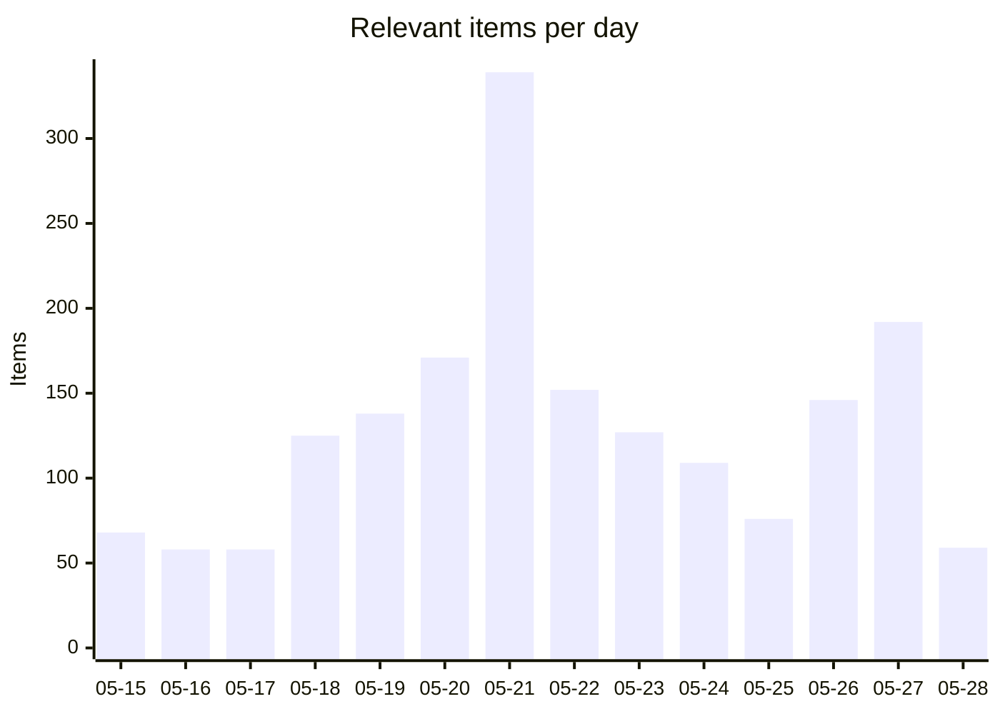
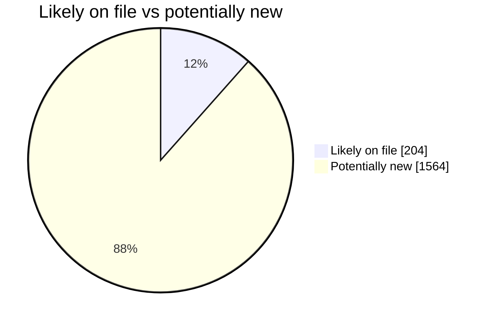
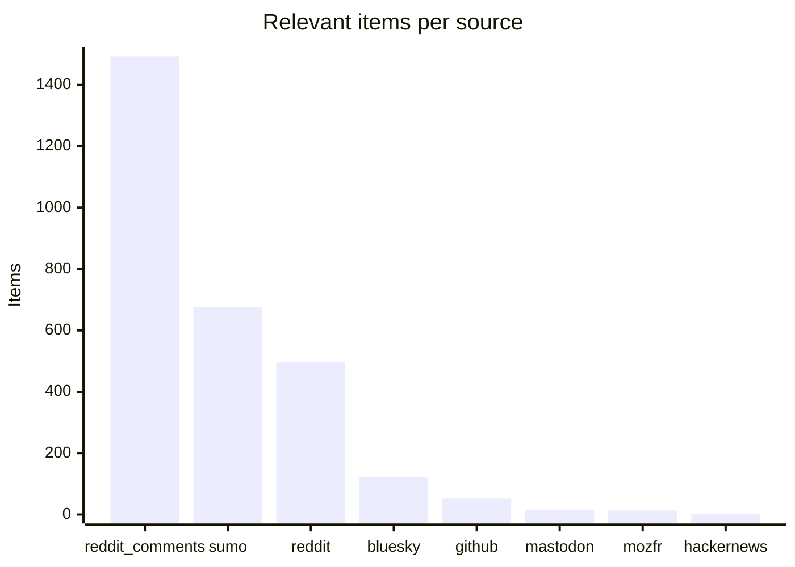
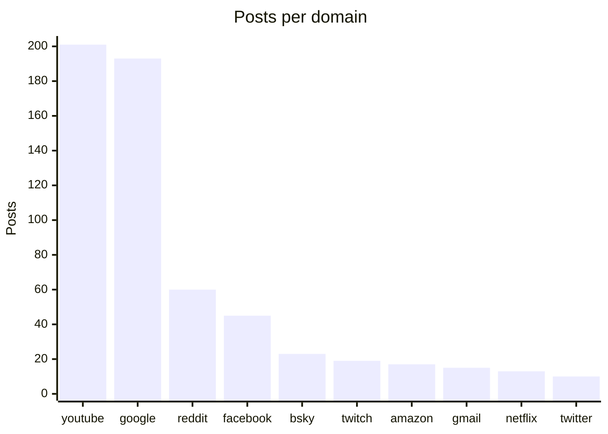

# Social Scanner — WebCompat dashboard

Auto-generated WebCompat signal from Reddit (submissions + r/firefox comments), Hacker News, Bluesky, Mastodon, and support.mozilla.org. Posts are classified via Claude Haiku into site-specific webcompat issues and Firefox-platform issues, cross-referenced against Bugzilla and webcompat/web-bugs to surface what's already on file.

_Generated: 2026-05-28T10:44:07.659830+00:00 · Last scan: 2026-05-28T09:38:39.303625+00:00_

## Headlines

| | Count |
|---|---:|
| Posts pulled across all sources | 17,104 |
| Posts classified relevant | **2870** |
| ↳ Webcompat with a domain | 915 |
| ↳ Webcompat without a clear domain | 40 |
| ↳ Firefox platform issues | 853 |

### Bugs on file vs potentially new

| Bucket | Items | With likely match | Potentially new |
|---|---:|---:|---:|
| Webcompat (with domain) | 915 | 153 | **762** |
| Firefox platform | 853 | 51 | **802** |

**1604 actionable items** (no clear matching bug filed): 762 webcompat-with-domain, 40 webcompat-no-domain, 802 platform.

## Charts

### Daily relevant items (last 14 days)

### Bugs on file vs potentially new

### Relevant items by source

### Top domains by report volume

## Trends (week over week)

**1200** relevant items this week vs **705** last week (+495, up).

**Escalating domains** (≥2 more reports this week):
- `google.com`: 47 → 117 (+70)
- `amazon.com`: 3 → 11 (+8)
- `reddit.com`: 9 → 17 (+8)
- `gmail.com`: 2 → 5 (+3)
- `netflix.com`: 4 → 6 (+2)

**New domains** (no reports last week, ≥2 this week):
- `ebay.com`: 4 reports
- `aol.com`: 2 reports
- `linkedin.com`: 2 reports
- `maps.google.com`: 2 reports
- `pinkpost.com`: 2 reports
- `qwant.com`: 2 reports

## Top clusters

Domains by report volume across the entire dataset:

| Domain | Posts | Likely match on file | Potentially new |
|---|---:|---:|---:|
| `youtube.com` | 201 | 23 | **178** |
| `google.com` | 193 | 47 | **146** |
| `reddit.com` | 60 | 5 | **55** |
| `facebook.com` | 45 | 0 | **45** |
| `bsky.app` | 23 | 11 | **12** |
| `twitch.tv` | 19 | 13 | **6** |
| `amazon.com` | 17 | 3 | **14** |
| `gmail.com` | 15 | 1 | **14** |
| `netflix.com` | 13 | 8 | **5** |
| `twitter.com` | 10 | 6 | **4** |

## High-urgency items with no matching bug

Top webcompat reports by urgency where the matcher found no likely match in Bugzilla or webcompat/web-bugs. These are the candidates for a new filing:

- **`netflix.com`** · urgency 95 · sumo
  Netflix login accepts only email, skips captcha after error, grants account access.
  · [post](https://support.mozilla.org/en-US/questions/1581269)
- **`hrblock.com`** · urgency 85 · reddit
  Firefox 150.0 fails to login to hrblock.com; session times out after entering credentials, but works in Edge.
  · [post](https://reddit.com/r/firefox/comments/1svio4d/ff_v1500_cant_login_to_hrblockcom/)
- **`disneyplus.com`** · urgency 85 · reddit
  Firefox Nightly 152.0a1 broke video playback on Disney+ and HBO Max.
  · [post](https://reddit.com/r/firefox/comments/1t5fvou/nightly_update_1520a1_20260505214504_broke/)
- **`capitalone.com`** · urgency 85 · reddit
  Capital One login page auto-jumps to another tab 1s after loading, blocking credential entry.
  · [post](https://reddit.com/r/firefox/comments/1tc4o4o/firefox_15003_64bit_has_started_jumping_from_one/)
- **`id.me`** · urgency 85 · reddit
  id.me video selfie capture fails on Firefox Android with "device doesn't support motion photography" error.
  · [post](https://reddit.com/r/firefox/comments/1tdk6mw/trying_to_complete_account_creation_at_government/)

## High-urgency Firefox platform issues

Top platform-level reports by urgency. These don't tie to a single domain:

- urgency 95 · Firefox JIT compiler vulnerability allows arbitrary code execution on Windows.
  · [post](https://reddit.com/r/firefox/comments/1ta0qcn/fullchain_firefox_exploit_on_windows/oldg8d7/)
- urgency 95 · Firefox for Android has a keyboard input bug that prevents basic functionality for 4 weeks.
  · [post](https://reddit.com/r/firefox/comments/1t0877l/pains_me_to_see_a_stat_like_this/olqbjob/)
- urgency 95 · Firefox upgrade moved or lost access to home folder/profile location
  · [post](https://reddit.com/r/firefox/comments/1tfdwso/upgraded_lost_everything/omenpfn/)
- urgency 95 · User lost bookmarks and profile data after a Firefox update despite having sync enabled.
  · [post](https://reddit.com/r/firefox/comments/1thtq98/just_lost_my_whole_profile_and_years_of_bookmark/ompt3s0/)
- urgency 95 · Profile and bookmarks lost after updating Firefox.
  · [post](https://reddit.com/r/firefox/comments/1thtq98/just_lost_my_whole_profile_and_years_of_bookmark/ompquv8/)

## Platform issues already on file

Platform reports the matcher confirmed against existing bugs:

- **Firefox Mobile deletes downloaded files when closing incognito or when auto-deleting histo** → [BMO#947536](https://bugzilla.mozilla.org/show_bug.cgi?id=947536)  _When Firefox restarts after crash, it deletes active downloaded files, and start_
- **Firefox Mobile silently deleting downloaded files after update.** → [BMO#947536](https://bugzilla.mozilla.org/show_bug.cgi?id=947536)  _When Firefox restarts after crash, it deletes active downloaded files, and start_
- **Firefox 149.0 crashes with "Unhandled external image format" when moving tabs repeatedly o** → [BMO#1865713](https://bugzilla.mozilla.org/show_bug.cgi?id=1865713)  _Assertion failure: false (Unhandled external image format), at /gfx/webrender_bi_
- **Bookmarks disappeared after Firefox update; restore function not working.** → [BMO#2017721](https://bugzilla.mozilla.org/show_bug.cgi?id=2017721)  _all my bookmarks thumbnails disappeared (BIG POOF!)_
- **Firefox freezes when opening a new tab on Windows 10 after recent update.** → [BMO#1896887](https://bugzilla.mozilla.org/show_bug.cgi?id=1896887)  _Intermittent Firefox bug freezes browser when opening multiple tabs, impacting u_

## Latest reports

- [2026-05-28](2026/2026-05/2026-05-28.md) — 59 items
- [2026-05-27](2026/2026-05/2026-05-27.md) — 192 items
- [2026-05-26](2026/2026-05/2026-05-26.md) — 146 items
- [2026-05-25](2026/2026-05/2026-05-25.md) — 76 items
- [2026-05-24](2026/2026-05/2026-05-24.md) — 109 items
- [2026-05-23](2026/2026-05/2026-05-23.md) — 127 items
- [2026-05-22](2026/2026-05/2026-05-22.md) — 152 items
- [2026-05-21](2026/2026-05/2026-05-21.md) — 339 items
- [2026-05-20](2026/2026-05/2026-05-20.md) — 171 items
- [2026-05-19](2026/2026-05/2026-05-19.md) — 138 items

## Browse

- [Full reports index](index.md) — every dated report, by month

## How to read each report

Every relevant item carries:

- Source link (Reddit / HN / Bluesky / Mastodon / SUMO)
- Posted timestamp, score, comment count
- Sentiment, severity, urgency score (0-100)
- Gist (one-line summary)
- Reproduction steps when present
- Bug cross-references grouped by match verdict: **Likely match**, **Maybe related**, **Same domain different issue**

The triage round-trip lets you mark items `[x]` triaged or `` `[filed:: BMO#1234567]` `` directly in any report's markdown — the next sync picks up your edits and persists them.

---

_This README is regenerated on every sync from `social-scanner share`. To refresh manually: `uv run social-scanner share`._
