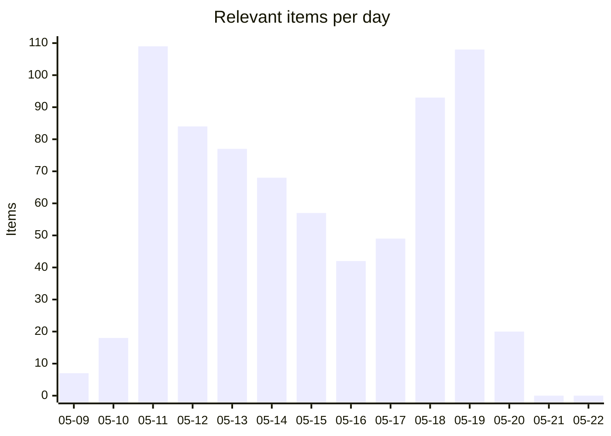
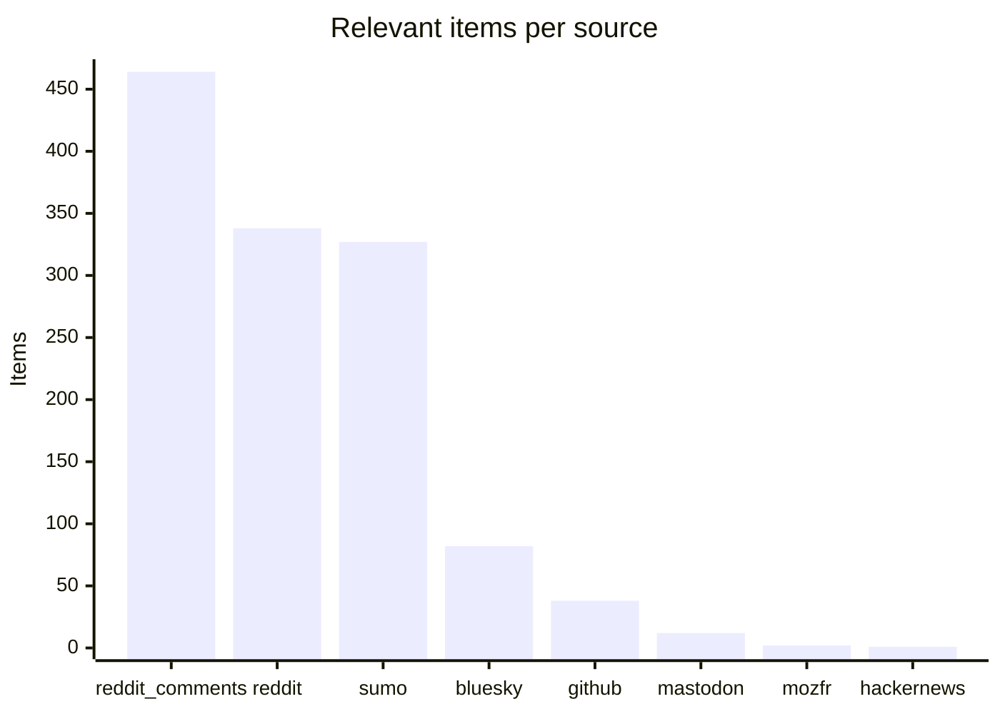
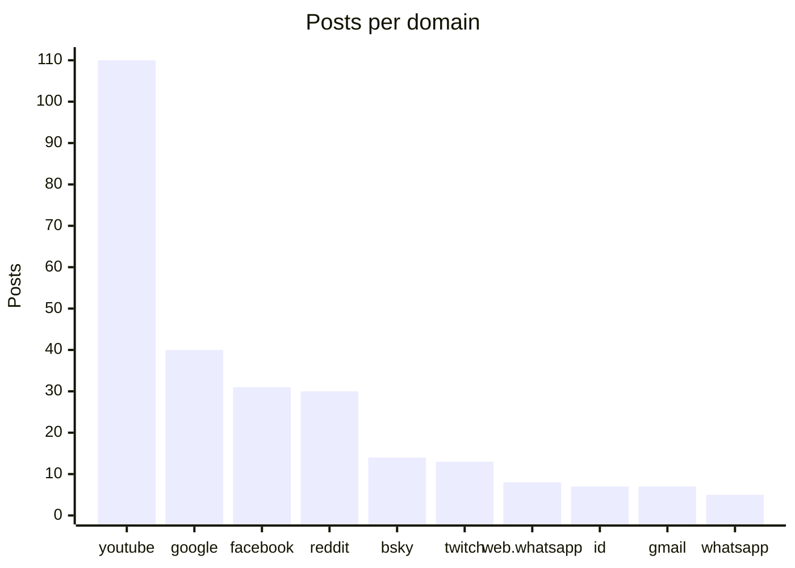

# Social Scanner — WebCompat dashboard

Auto-generated WebCompat signal from Reddit (submissions + r/firefox comments), Hacker News, Bluesky, Mastodon, and support.mozilla.org. Posts are classified via Claude Haiku into site-specific webcompat issues and Firefox-platform issues, cross-referenced against Bugzilla and webcompat/web-bugs to surface what's already on file.

_Generated: 2026-05-22T19:24:19.631280+00:00 · Last scan: 2026-05-22T12:05:00.625668+00:00_

## Headlines

| | Count |
|---|---:|
| Posts pulled across all sources | 12,612 |
| Posts classified relevant | **1264** |
| ↳ Webcompat with a domain | 462 |
| ↳ Webcompat without a clear domain | 24 |
| ↳ Firefox platform issues | 778 |

### Bugs on file vs potentially new

| Bucket | Items | With likely match | Potentially new |
|---|---:|---:|---:|
| Webcompat (with domain) | 462 | 90 | **372** |
| Firefox platform | 778 | 46 | **732** |

**1128 actionable items** (no clear matching bug filed): 372 webcompat-with-domain, 24 webcompat-no-domain, 732 platform.

## Charts

### Daily relevant items (last 14 days)

### Bugs on file vs potentially new

### Relevant items by source

### Top domains by report volume

## Trends (week over week)

**369** relevant items this week vs **419** last week (-50, down).

**Escalating domains** (≥2 more reports this week):
- `youtube.com`: 32 → 40 (+8)
- `google.com`: 10 → 15 (+5)
- `twitch.tv`: 3 → 6 (+3)

**New domains** (no reports last week, ≥2 this week):
- `id.me`: 7 reports
- `protonmail.com`: 3 reports
- `chatgpt.com`: 2 reports
- `newgrounds.com`: 2 reports

## Top clusters

Domains by report volume across the entire dataset:

| Domain | Posts | Likely match on file | Potentially new |
|---|---:|---:|---:|
| `youtube.com` | 110 | 21 | **89** |
| `google.com` | 40 | 23 | **17** |
| `facebook.com` | 31 | 0 | **31** |
| `reddit.com` | 30 | 3 | **27** |
| `bsky.app` | 14 | 6 | **8** |
| `twitch.tv` | 13 | 7 | **6** |
| `web.whatsapp.com` | 8 | 2 | **6** |
| `id.me` | 7 | 0 | **7** |
| `gmail.com` | 7 | 0 | **7** |
| `whatsapp.com` | 5 | 0 | **5** |

## High-urgency items with no matching bug

Top webcompat reports by urgency where the matcher found no likely match in Bugzilla or webcompat/web-bugs. These are the candidates for a new filing:

- **`jquery.com`** · urgency 85 · github
  jQuery animation promise gets stuck in infinite loop when `.then()` handler added in start callback, freezing browser
  · [post](https://github.com/jquery/jquery/issues/5534)
- **`amazon.com`** · urgency 85 · sumo
  Firefox freezes during Amazon login and security authentication, causing payment failures; works in Safari.
  · [post](https://support.mozilla.org/en-US/questions/1580185)
- **`paypal.com`** · urgency 85 · sumo
  PayPal page fails to load in Firefox desktop but works in Chrome and other browsers.
  · [post](https://support.mozilla.org/en-US/questions/1580318)
- **`att.com`** · urgency 85 · reddit
  AT&T email login page stuck/hanging only in Firefox, works in Chrome/Brave/Safari/Edge.
  · [post](https://reddit.com/r/firefox/comments/1t218fe/mozilla_user_for_20_years_ff_is_now_the_only/)
- **`youtube.com`** · urgency 85 · reddit
  YouTube videos stop playing after exactly one minute with grey screen in Firefox 150.0.3, solved temporarily by profile 
  · [post](https://reddit.com/r/firefox/comments/1th369d/youtube_again/)

## High-urgency Firefox platform issues

Top platform-level reports by urgency. These don't tie to a single domain:

- urgency 95 · User lost their entire Firefox profile and years of bookmarks after a recent update.
  · [post](https://reddit.com/r/firefox/comments/1thtq98/just_lost_my_whole_profile_and_years_of_bookmark/ompi7kc/)
- urgency 95 · Firefox profile and years of bookmarks lost after an update
  · [post](https://reddit.com/r/firefox/comments/1thtq98/just_lost_my_whole_profile_and_years_of_bookmark/omqbi07/)
- urgency 95 · Firefox update caused loss of entire profile and bookmarks.
  · [post](https://reddit.com/r/firefox/comments/1thtq98/just_lost_my_whole_profile_and_years_of_bookmark/omq5me5/)
- urgency 92 · Firefox 150.0.3 causes severe CPU/RAM spike and system BSODs when used with YouTube.
  · [post](https://reddit.com/r/firefox/comments/1tb4vye/firefox_15003_is_out_release_notes_security/olgleo1/)
- urgency 92 · Firefox lost all saved passwords after an automatic update, leaving only corrupt logins.json files
  · [post](https://support.mozilla.org/en-US/questions/1582535)

## Platform issues already on file

Platform reports the matcher confirmed against existing bugs:

- **Firefox 140.9.1esr and later show some PDFs as blank white pages while other browsers and ** → [BMO#1671854](https://bugzilla.mozilla.org/show_bug.cgi?id=1671854)  _pdf-viewer renders certain files incorrectly_
- **Bookmarks imported from Chrome are not visible in Firefox 150.0.1 after import.** → [BMO#2037345](https://bugzilla.mozilla.org/show_bug.cgi?id=2037345)  _Imported Bookmarks from Chrome, but nowhere it is visible in Firefox Browser_
- **All bookmarks disappeared after Firefox update.** → [BMO#2017721](https://bugzilla.mozilla.org/show_bug.cgi?id=2017721)  _all my bookmarks thumbnails disappeared (BIG POOF!)_
- **Firefox won't load any pages while other browsers work, appearing offline.** → [BMO#1802960](https://bugzilla.mozilla.org/show_bug.cgi?id=1802960)  _YouTube history and other pages intermittently fails to fully load_
- **Firefox freezes for several minutes after creating a new tab** → [BMO#330135](https://bugzilla.mozilla.org/show_bug.cgi?id=330135)  _CPU 100% with random freezes (several seconds to over 7 minutes) when loading pa_

## Latest reports

- [2026-05-20](2026/2026-05/2026-05-20.md) — 20 items
- [2026-05-19](2026/2026-05/2026-05-19.md) — 108 items
- [2026-05-18](2026/2026-05/2026-05-18.md) — 93 items
- [2026-05-17](2026/2026-05/2026-05-17.md) — 49 items
- [2026-05-16](2026/2026-05/2026-05-16.md) — 42 items
- [2026-05-15](2026/2026-05/2026-05-15.md) — 57 items
- [2026-05-14](2026/2026-05/2026-05-14.md) — 68 items
- [2026-05-13](2026/2026-05/2026-05-13.md) — 77 items
- [2026-05-12](2026/2026-05/2026-05-12.md) — 84 items
- [2026-05-11](2026/2026-05/2026-05-11.md) — 109 items

## Browse

- [Full reports index](index.md) — every dated report, by month

## How to read each report

Every relevant item carries:

- Source link (Reddit / HN / Bluesky / Mastodon / SUMO)
- Posted timestamp, score, comment count
- Sentiment, severity, urgency score (0-100)
- Gist (one-line summary)
- Reproduction steps when present
- Bug cross-references grouped by match verdict: **Likely match**, **Maybe related**, **Same domain different issue**

The triage round-trip lets you mark items `[x]` triaged or `` `[filed:: BMO#1234567]` `` directly in any report's markdown — the next sync picks up your edits and persists them.

---

_This README is regenerated on every sync from `social-scanner share`. To refresh manually: `uv run social-scanner share`._
