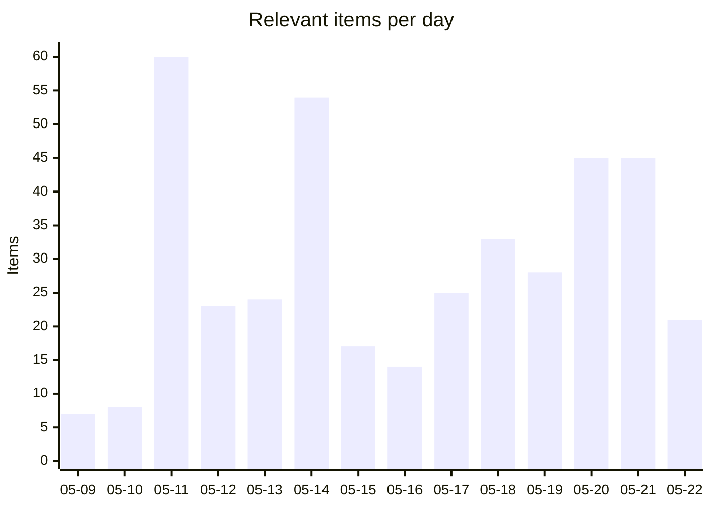
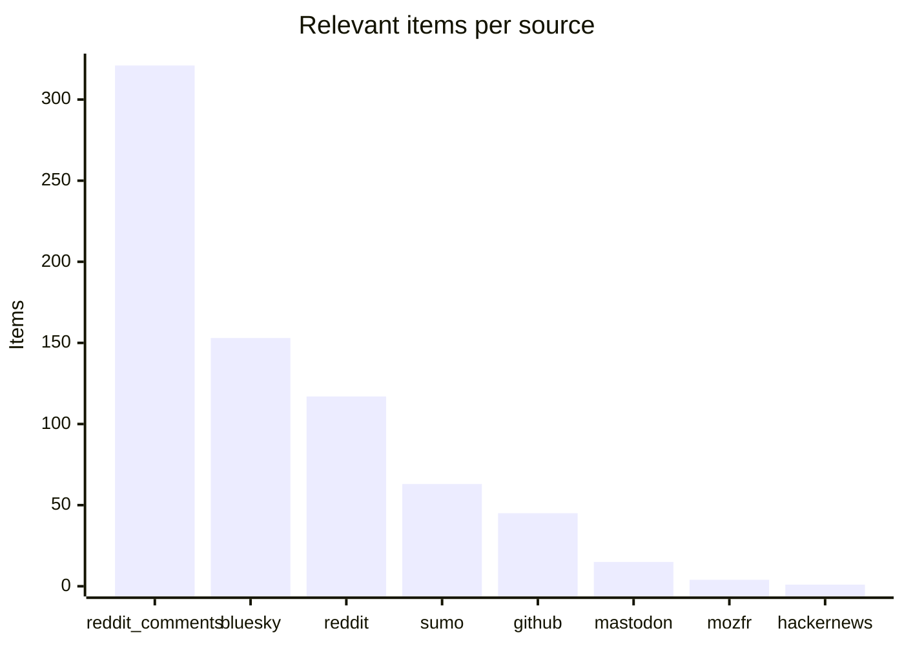
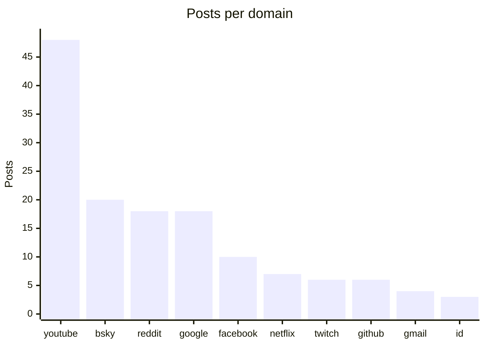

# Social Scanner — WebCompat dashboard

Auto-generated WebCompat signal from Reddit (submissions + r/firefox comments), Hacker News, Bluesky, Mastodon, and support.mozilla.org. Posts are classified via Claude Haiku into site-specific webcompat issues and Firefox-platform issues, cross-referenced against Bugzilla and webcompat/web-bugs to surface what's already on file.

_Generated: 2026-05-22T12:07:22.270952+00:00 · Last scan: 2026-05-22T12:05:00.625668+00:00_

## Headlines

| | Count |
|---|---:|
| Posts pulled across all sources | 12,528 |
| Posts classified relevant | **719** |
| ↳ Webcompat with a domain | 215 |
| ↳ Webcompat without a clear domain | 29 |
| ↳ Firefox platform issues | 472 |

### Bugs on file vs potentially new

| Bucket | Items | With likely match | Potentially new |
|---|---:|---:|---:|
| Webcompat (with domain) | 215 | 77 | **138** |
| Firefox platform | 472 | 39 | **433** |

**600 actionable items** (no clear matching bug filed): 138 webcompat-with-domain, 29 webcompat-no-domain, 433 platform.

## Charts

### Daily relevant items (last 14 days)

### Bugs on file vs potentially new

### Relevant items by source

### Top domains by report volume

## Trends (week over week)

**228** relevant items this week vs **193** last week (+35, up).

**Escalating domains** (≥2 more reports this week):
- `google.com`: 2 → 12 (+10)
- `netflix.com`: 2 → 4 (+2)

**New domains** (no reports last week, ≥2 this week):
- `id.me`: 3 reports
- `docs.google.com`: 2 reports
- `twitter.com`: 2 reports

## Top clusters

Domains by report volume across the entire dataset:

| Domain | Posts | Likely match on file | Potentially new |
|---|---:|---:|---:|
| `youtube.com` | 48 | 29 | **19** |
| `bsky.app` | 20 | 12 | **8** |
| `reddit.com` | 18 | 7 | **11** |
| `google.com` | 18 | 10 | **8** |
| `facebook.com` | 10 | 0 | **10** |
| `netflix.com` | 7 | 6 | **1** |
| `twitch.tv` | 6 | 4 | **2** |
| `github.com` | 6 | 1 | **5** |
| `gmail.com` | 4 | 0 | **4** |
| `id.me` | 3 | 0 | **3** |

## High-urgency items with no matching bug

Top webcompat reports by urgency where the matcher found no likely match in Bugzilla or webcompat/web-bugs. These are the candidates for a new filing:

- **`facebook.com`** · urgency 85 · bluesky
  User cannot log in to Facebook in Firefox 150, but login works in Edge.
  · [post](https://bsky.app/profile/mozilla.activitypub.awakari.com.ap.brid.gy/post/3mk52zlum25o2)
- **`supabase.com`** · urgency 85 · github
  Supabase Control Panel throws DOM error in Firefox, Edge, and Chrome; breaks product access.
  · [post](https://github.com/facebook/react/issues/35698)
- **`youtube.com`** · urgency 85 · reddit
  YouTube videos cause extreme memory consumption (1.5–7.5 GB per tab) and performance degradation in Firefox since recent
  · [post](https://reddit.com/r/firefox/comments/1syx195/terrible_performance_while_watching_youtube/)
- **`youtube.com`** · urgency 85 · reddit_comments
  YouTube interface bug causes excessive RAM usage (7GB+) and browser lag/freezing.
  · [post](https://reddit.com/r/firefox/comments/1t3p7uy/seeing_higher_ram_usage_in_firefox_lately_this/ok8v5ff/)
- **`reddit.com`** · urgency 85 · reddit_comments
  Reddit is completely broken in Firefox.
  · [post](https://reddit.com/r/firefox/comments/1te90if/reddit_doesnt_work_at_all/omi0knf/)

## High-urgency Firefox platform issues

Top platform-level reports by urgency. These don't tie to a single domain:

- urgency 95 · Firefox on Android has severe typing lag, text doubling, and is described as inoperable after update.
  · [post](https://reddit.com/r/firefox/comments/1sulw2g/typing_text_lagdoublingbugged_since_update/olqa7ur/)
- urgency 95 · Firefox Android has text input bug causing word doubling and random characters for 7+ months.
  · [post](https://reddit.com/r/firefox/comments/1taoury/word_doubling_and_random_carcarratr_scintillating/olqfg2n/)
- urgency 95 · Firefox update caused loss of user's entire profile and years of bookmarks.
  · [post](https://reddit.com/r/firefox/comments/1thtq98/just_lost_my_whole_profile_and_years_of_bookmark/ompjtfz/)
- urgency 95 · Firefox update caused loss of entire user profile and years of bookmarks.
  · [post](https://reddit.com/r/firefox/comments/1thtq98/just_lost_my_whole_profile_and_years_of_bookmark/omxynl2/)
- urgency 95 · Firefox 151 for Android is deleting user-saved local files when closing an incognito tab.
  · [post](https://bsky.app/profile/piunikaweb.bsky.social/post/3mmdw3ys5u22v)

## Platform issues already on file

Platform reports the matcher confirmed against existing bugs:

- **Firefox 149.0 crashes repeatedly when moving tabs, even after extensions disabled.** → [BMO#1865713](https://bugzilla.mozilla.org/show_bug.cgi?id=1865713)  _Assertion failure: false (Unhandled external image format), at /gfx/webrender_bi_
- **Firefox Mobile automatically deleting downloaded files after update due to problematic def** → [BMO#947536](https://bugzilla.mozilla.org/show_bug.cgi?id=947536)  _When Firefox restarts after crash, it deletes active downloaded files, and start_
- **Firefox 140.9.1+ renders certain PDFs as blank white pages while other browsers display th** → [BMO#1671854](https://bugzilla.mozilla.org/show_bug.cgi?id=1671854)  _pdf-viewer renders certain files incorrectly_
- **Firefox Mobile is unexpectedly deleting downloaded files when closing incognito or auto-de** → [BMO#947536](https://bugzilla.mozilla.org/show_bug.cgi?id=947536)  _When Firefox restarts after crash, it deletes active downloaded files, and start_
- **Firefox won't load any pages while other browsers work fine; appears offline.** → [BMO#1802960](https://bugzilla.mozilla.org/show_bug.cgi?id=1802960)  _YouTube history and other pages intermittently fails to fully load_

## Latest reports

- [2026-05-22](2026/2026-05/2026-05-22.md) — 21 items
- [2026-05-21](2026/2026-05/2026-05-21.md) — 45 items
- [2026-05-20](2026/2026-05/2026-05-20.md) — 45 items
- [2026-05-19](2026/2026-05/2026-05-19.md) — 28 items
- [2026-05-18](2026/2026-05/2026-05-18.md) — 33 items
- [2026-05-17](2026/2026-05/2026-05-17.md) — 25 items
- [2026-05-16](2026/2026-05/2026-05-16.md) — 14 items
- [2026-05-15](2026/2026-05/2026-05-15.md) — 17 items
- [2026-05-14](2026/2026-05/2026-05-14.md) — 54 items
- [2026-05-13](2026/2026-05/2026-05-13.md) — 24 items

## Browse

- [Full reports index](index.md) — every dated report, by month

## How to read each report

Every relevant item carries:

- Source link (Reddit / HN / Bluesky / Mastodon / SUMO)
- Posted timestamp, score, comment count
- Sentiment, severity, urgency score (0-100)
- Gist (one-line summary)
- Reproduction steps when present
- Bug cross-references grouped by match verdict: **Likely match**, **Maybe related**, **Same domain different issue**

The triage round-trip lets you mark items `[x]` triaged or `` `[filed:: BMO#1234567]` `` directly in any report's markdown — the next sync picks up your edits and persists them.

---

_This README is regenerated on every sync from `social-scanner share`. To refresh manually: `uv run social-scanner share`._
