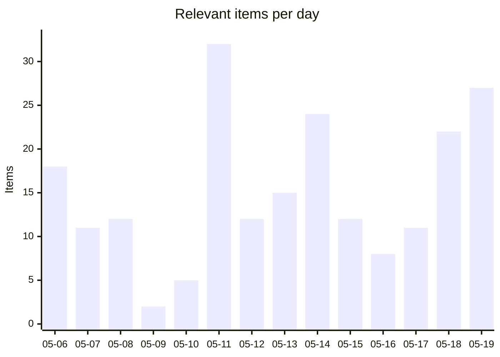
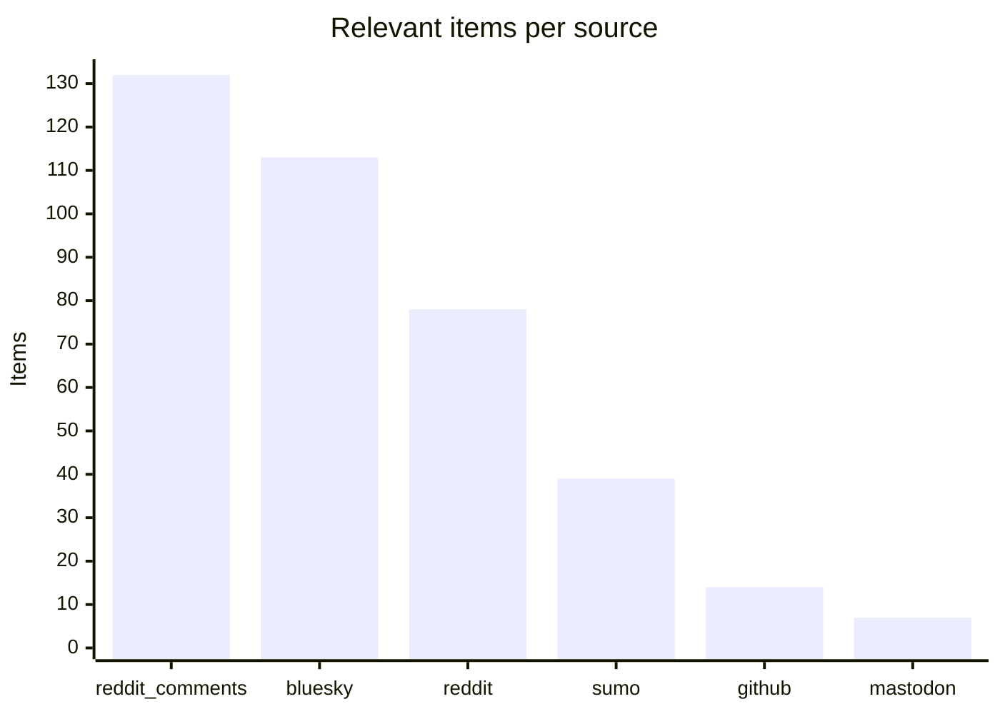
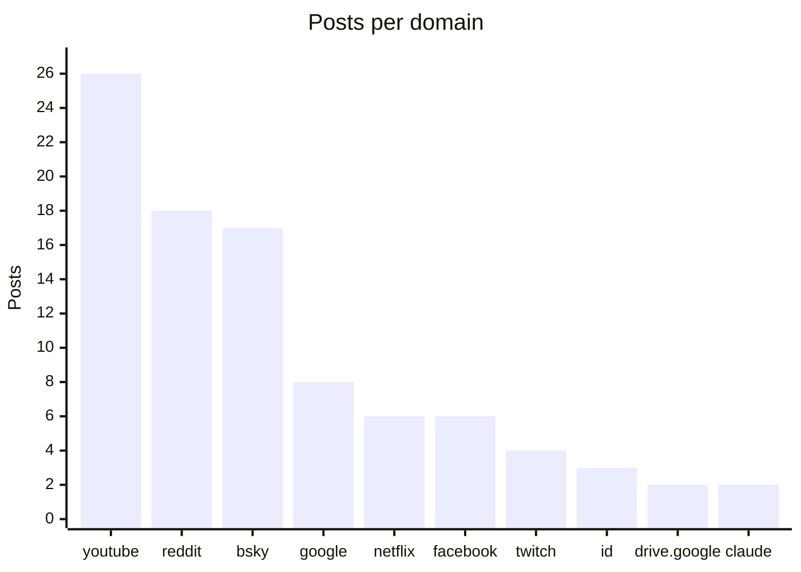

# Social Scanner — WebCompat dashboard

Auto-generated WebCompat signal from Reddit (submissions + r/firefox comments), Hacker News, Bluesky, Mastodon, and support.mozilla.org. Posts are classified via Claude Haiku into site-specific webcompat issues and Firefox-platform issues, cross-referenced against Bugzilla and webcompat/web-bugs to surface what's already on file.

_Generated: 2026-05-19T22:05:55.365051+00:00 · Last scan: 2026-05-19T22:05:05.621385+00:00_

## Headlines

| | Count |
|---|---:|
| Posts pulled across all sources | 10,096 |
| Posts classified relevant | **383** |
| ↳ Webcompat with a domain | 137 |
| ↳ Webcompat without a clear domain | 27 |
| ↳ Firefox platform issues | 215 |

### Bugs on file vs potentially new

| Bucket | Items | With likely match | Potentially new |
|---|---:|---:|---:|
| Webcompat (with domain) | 137 | 32 | **105** |
| Firefox platform | 215 | 9 | **206** |

**338 actionable items** (no clear matching bug filed): 105 webcompat-with-domain, 27 webcompat-no-domain, 206 platform.

## Charts

### Daily relevant items (last 14 days)

### Bugs on file vs potentially new

### Relevant items by source

### Top domains by report volume

## Trends (week over week)

**131** relevant items this week vs **91** last week (+40, up).

**Escalating domains** (≥2 more reports this week):
- `youtube.com`: 1 → 16 (+15)

**New domains** (no reports last week, ≥2 this week):
- `google.com`: 5 reports
- `netflix.com`: 5 reports
- `id.me`: 3 reports

## Top clusters

Domains by report volume across the entire dataset:

| Domain | Posts | Likely match on file | Potentially new |
|---|---:|---:|---:|
| `youtube.com` | 26 | 13 | **13** |
| `reddit.com` | 18 | 1 | **17** |
| `bsky.app` | 17 | 7 | **10** |
| `google.com` | 8 | 2 | **6** |
| `netflix.com` | 6 | 5 | **1** |
| `facebook.com` | 6 | 0 | **6** |
| `twitch.tv` | 4 | 0 | **4** |
| `id.me` | 3 | 0 | **3** |
| `drive.google.com` | 2 | 1 | **1** |
| `claude.ai` | 2 | 2 | **0** |

## High-urgency items with no matching bug

Top webcompat reports by urgency where the matcher found no likely match in Bugzilla or webcompat/web-bugs. These are the candidates for a new filing:

- **`youtube.com`** · urgency 85 · reddit
  YouTube won't load at all in Firefox for 5+ days, works in Edge
  · [post](https://reddit.com/r/firefox/comments/1tcx3ha/youtube_wont_load_at_all/)
- **`coingecko.com`** · urgency 85 · reddit_comments
  Firefox runs out of memory and becomes unresponsive on coingecko portfolio and lastminute.com search pages.
  · [post](https://reddit.com/r/firefox/comments/1t7uf0r/is_firefox_having_a_memory_leak_right_now/ol56wpe/)
- **`google.com`** · urgency 85 · mastodon
  Google Search broken on Firefox Android for hours; requests return malformed HTML.
  · [post](https://mastodon.cloud/@karlcow/111726266200532862)
- **`amazon.com`** · urgency 85 · sumo
  Firefox freezes during Amazon login/security interactions; purchase failures; Safari works fine.
  · [post](https://support.mozilla.org/en-US/questions/1580185)
- **`att.com`** · urgency 82 · reddit
  AT&T email login screen hangs and times out in Firefox only.
  · [post](https://reddit.com/r/firefox/comments/1t218fe/mozilla_user_for_20_years_ff_is_now_the_only/)

## High-urgency Firefox platform issues

Top platform-level reports by urgency. These don't tie to a single domain:

- urgency 95 · Firefox on Android freezes, locks up OS, has bookmark bugs, and causes site lockups.
  · [post](https://reddit.com/r/firefox/comments/1t9xssv/firefox_unusable_on_android_p9/)
- urgency 85 · Firefox showing certificate errors on all pages including mozilla.org
  · [post](https://bsky.app/profile/lexomatic.bsky.social/post/3mkkxe3o3ws2h)
- urgency 85 · Firefox 150 silently fails HTTP Basic Auth, returning NS_ERROR_FAILURE instead of prompting for credentials.
  · [post](https://reddit.com/r/firefox/comments/1t2t005/firefox_150_silently_fails_http_basic_auth_ns/)
- urgency 85 · Firefox Android won't load any web pages after recent update
  · [post](https://reddit.com/r/firefox/comments/1t0hh6t/firefox_android_not_working_after_the_most_recent/)
- urgency 85 · Firefox 149.0 crashes repeatedly when moving tabs; assertion error "Unhandled external image format"
  · [post](https://reddit.com/r/firefox/comments/1szcli8/firefox_1490_64bit_crashing_but_i_dont_know_what/)

## Platform issues already on file

Platform reports the matcher confirmed against existing bugs:

- **Firefox vertical tabs sidebar gets stuck expanded, blocking page and settings access.** → [BMO#1987303](https://bugzilla.mozilla.org/show_bug.cgi?id=1987303)  _When Windows animations are disabled, sometimes the vertical tabs sidebar gets s_
- **Firefox Sync not syncing bookmarks across Android and Ubuntu devices.** → [BMO#1972182](https://bugzilla.mozilla.org/show_bug.cgi?id=1972182)  _Issue with syncing Bookmarks on Firefox Android_
- **Right-click context menu not working in Firefox on NixOS** → [BMO#1762425](https://bugzilla.mozilla.org/show_bug.cgi?id=1762425)  _Firefox right click context menu not working properly in bspwm_
- **Audio not working on video players in Firefox** → [BMO#1933319](https://bugzilla.mozilla.org/show_bug.cgi?id=1933319)  _not working video and audio playback in video players_
- **Firefox context menus broken on Wayland after monitor power-cycle.** → [BMO#1564076](https://bugzilla.mozilla.org/show_bug.cgi?id=1564076)  _[Wayland] context menus not shown once deactivating external monitors_

## Latest reports

- [2026-05-19](2026/2026-05/2026-05-19.md) — 27 items
- [2026-05-18](2026/2026-05/2026-05-18.md) — 22 items
- [2026-05-17](2026/2026-05/2026-05-17.md) — 11 items
- [2026-05-16](2026/2026-05/2026-05-16.md) — 8 items
- [2026-05-15](2026/2026-05/2026-05-15.md) — 12 items
- [2026-05-14](2026/2026-05/2026-05-14.md) — 24 items
- [2026-05-13](2026/2026-05/2026-05-13.md) — 15 items
- [2026-05-12](2026/2026-05/2026-05-12.md) — 12 items
- [2026-05-11](2026/2026-05/2026-05-11.md) — 32 items
- [2026-05-10](2026/2026-05/2026-05-10.md) — 5 items

## Browse

- [Full reports index](index.md) — every dated report, by month

## How to read each report

Every relevant item carries:

- Source link (Reddit / HN / Bluesky / Mastodon / SUMO)
- Posted timestamp, score, comment count
- Sentiment, severity, urgency score (0-100)
- Gist (one-line summary)
- Reproduction steps when present
- Bug cross-references grouped by match verdict: **Likely match**, **Maybe related**, **Same domain different issue**

The triage round-trip lets you mark items `[x]` triaged or `` `[filed:: BMO#1234567]` `` directly in any report's markdown — the next sync picks up your edits and persists them.

---

_This README is regenerated on every sync from `social-scanner share`. To refresh manually: `uv run social-scanner share`._
